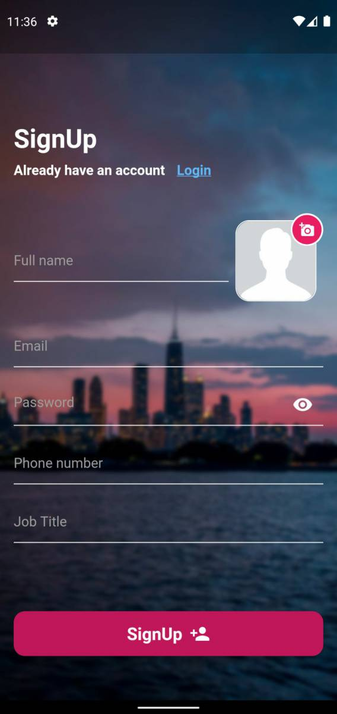
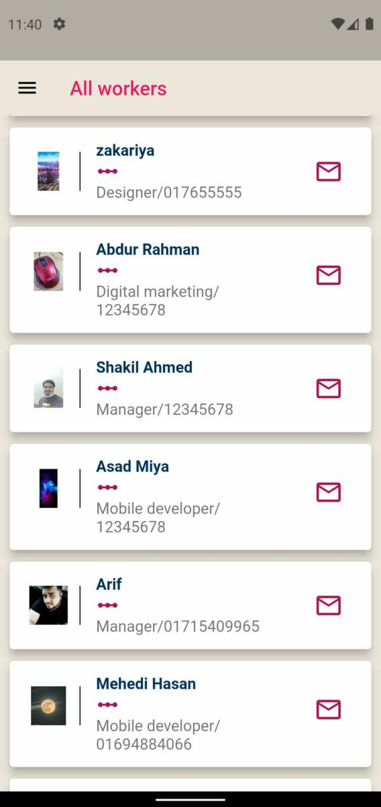
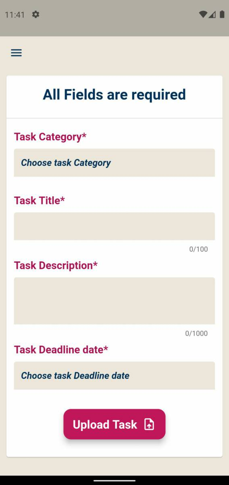
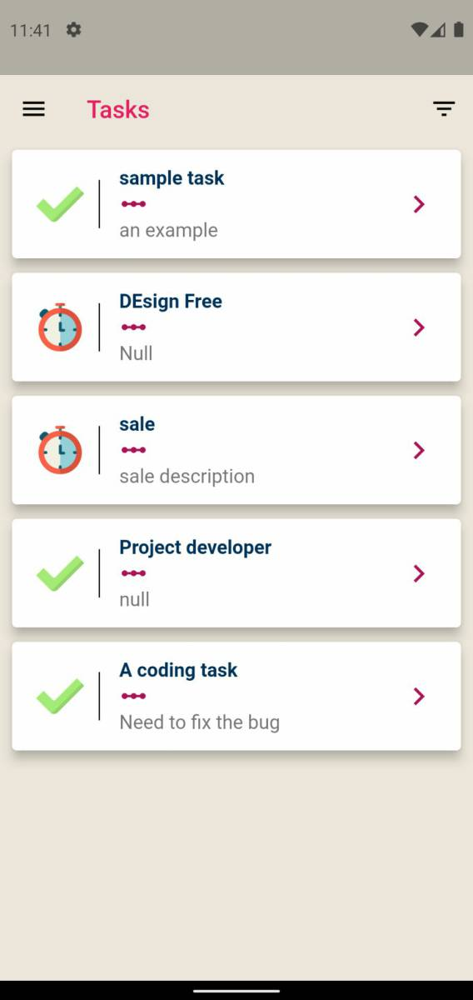
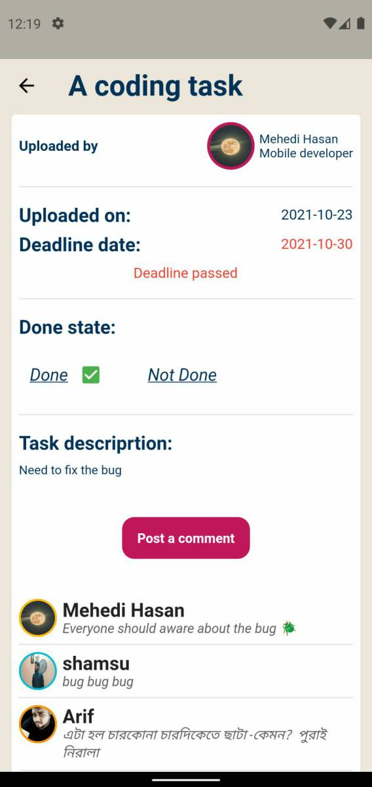

# TaskOS 📝
A task operation and management app.

><b>Platforms:</b> Android, iOS <b>Language/SDK:</b> Dart, Flutter

## **🎈 Screenshots**
&emsp;
&emsp;
&emsp;
&emsp;
&emsp;
&emsp;
 

## **🎈 Features**
* User profile and Worker contacts.
* Call, mail and Whatsapp to co-workers.
* Chat/comment on task.
* Author can upload, delete a task and change state.
* Other more features..

## **🎈 Remarks**

Click to collapse/fold.

* Packages: image_picker, image_cropper, url_launcher, fluttericon, firebase_auth, firebase_core, cloud_firestore, firebase_storage, uuid, fluttertoast.

